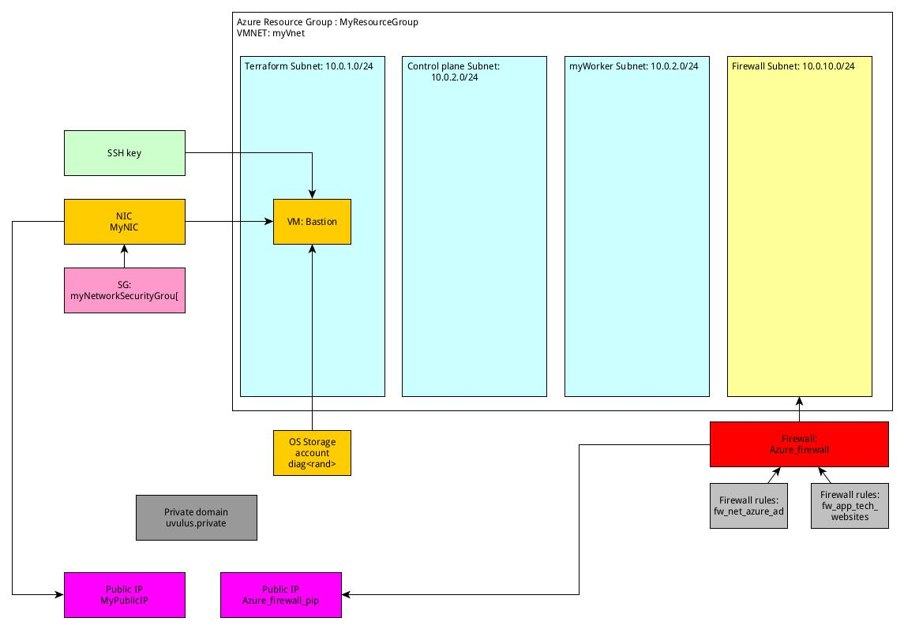
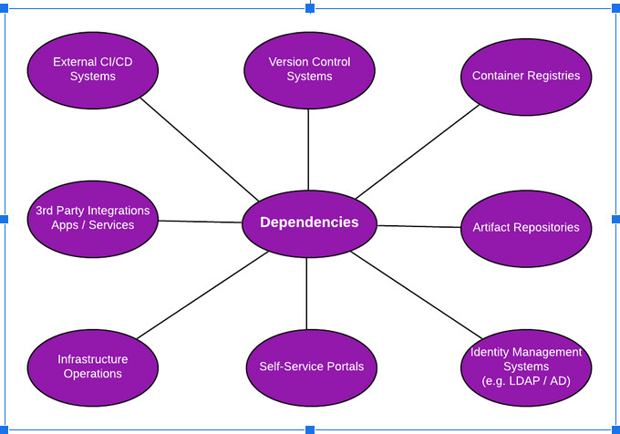
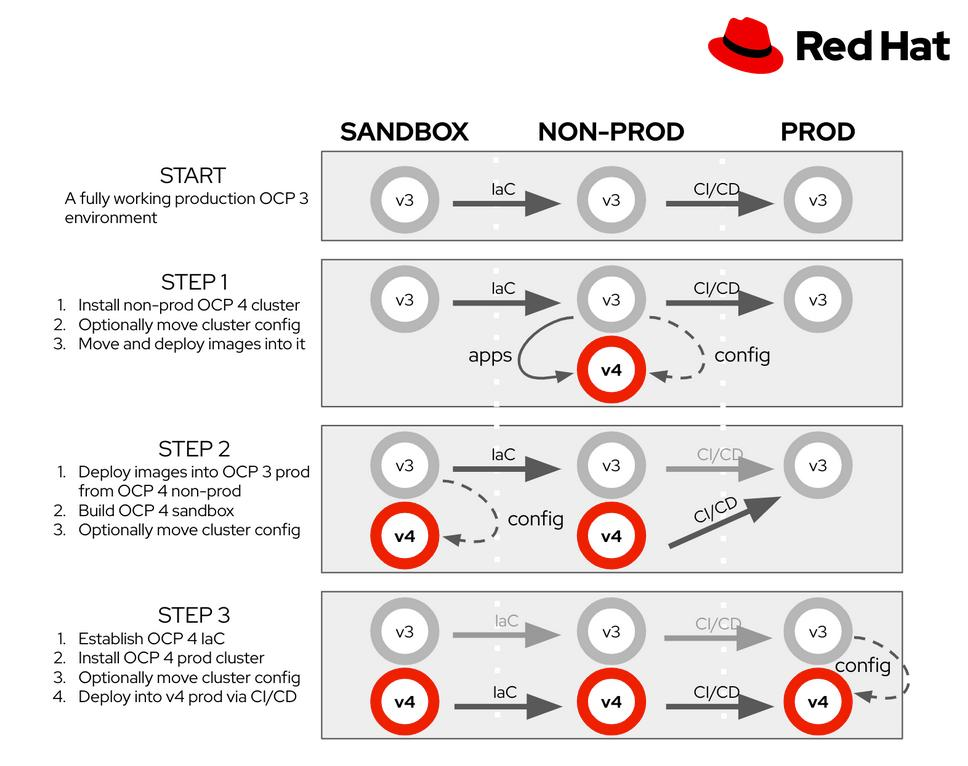
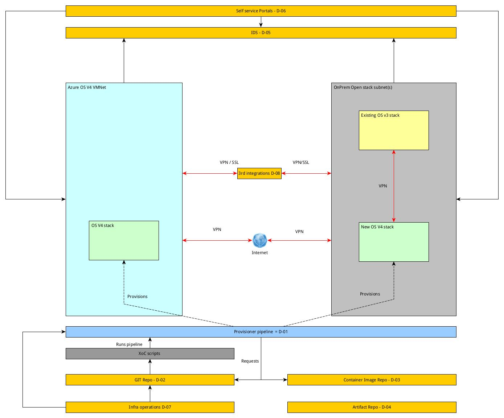

# Terraform Azure ARO setup example project

Latest change : `2022-11-23 `

This terraform project will set up the necessities for creating an ARO cluster: 

This code will first stand up a VNET, Bastion and firewall for the Azure Private network.

After running this you can continue to create a ARO install for internal network. 

The original project made by `thoward-rh` has been turned into a terraform-module so it inspires more reuse. 

[TL;DR: Quick start](#creating-the-infrastructure-on-azure)

Base setup, these components will be created, the values are the default ones that can be overridden in the module parameters: 




# Technical stack 

## Terraform 
[Terraform](https://www.terraform.io/) is arguably the industry standard for IaC with providers for virtually every cloud and VM provider out there. It has the advantage of being one language for many platorms 
as opposed of the CloudFormations and Azure Templates out there who are platform specific. 
It has the disadvantage to be always somewhat behind the latest Infrastructure developments and is just another extra language to learn. 
Terraform is a state driven provisioner, so it checks if resources exist, creates if they are not, and leave them be when they already exist (provided they were created by terraform).
Terraform infrastructure is stored in so called state files that describe the created infrastructure and will be used to assure the infrastructure against it. 

For instance, when creating a firewall, it will describe the firewall in a json state file usually called `terraform.tfstate` file. By default this will be on the machine running the apply, but it can be created in
a cloud storage as well, so it can be used by many processes. 


The concept of Terraform module is the packaging system that terraform uses, like ansible's galaxy or Openshift's Operator Hub, terraform delivers standard collections of infrastructure in the form of modules. 

These modules can be build yourself or be retrieved from the terraform repo, it is nothing more than a set of terraform scripts, stored in git with a tag / release attached and being able to pass parameters to them. 

For instance:   

```terraform
module "openshift-cluster-module" {
 source = "git@github.com:phiroict/terraform-azure-aro.git//terraform?ref=v1.0.0"
  # Params #############################################################################################################
  allowed_ingress_ipaddress = var.allowed_ingress_ipaddress
  controlpane_subnet_name = var.controlpane_subnet_name
  resourcegroup_name = var.resourcegroup_name
  subnet_firewall = var.subnet_firewall
  terraform_subnet_name = var.terraform_subnet_name
  traffic_source = var.traffic_source
  vm_name = var.vm_name
  vmnet_name = var.vmnet_name
  vm_os_disk = var.vm_os_disk
  vm_source_image = var.vm_source_image
  workerpane_subnet_name = var.workerpane_subnet_name
  vm_size = var.vm_size
  subnets_planes = var.subnets_planes
}
```

This points to the terraform repo with a tag (source / ref) and passes parameters to the script, terraform will download this script to the .terraform folder and run the terraform plan and apply from there. 
The variables are defined in the model as well as: 
```terraform
variable "resourcegroup_name" {
  default = "MyResourceGroup"
  type = string
}
```
In here you define the name, a meaningful default and the type.  


## Azure command line 
The azure commandline is the [cli interface](https://docs.microsoft.com/en-us/cli/azure/) for interacting with the Azure stack. You need to install the version of your OS and need an Azure subscription as well as access to the Azure API urls.  


# Creating the infrastructure on Azure.

## Prerequisites
### SSH keys 
The terraform script will generate a ssh key for you. You can use this, if you need to use an existing key you need to change that in the terraform script. 


### Account and resource alloation
IMPORTANT: First ensure you are logged into the right Azure account with the right access.
You also need into increase the standard CPU allocations / ensure these are sufficient. 
You need for running the demo ARO cluster that is generated by:  

`az aro create --resource-group MyResourceGroup --name aro_cluster --vnet myVnet --master-subnet myControlPlaneSubnet --worker-subnet myWorkerSubnet --apiserver-visibility Private --ingress-visibility Private --worker-vm-size Standard_D4as_v4`

These quotas you need to request, as the default `Pay As You Go` subscription does not allow the openshift to consume that many resources. 

| CPU family | Number of vCPUs | Default for PayG sub |
| --- | --- | --- |
| Cores | 50 | 10 |
| standardDSv3Family | 20 | 10 | 
| standardDASv4Family | 20 | 10 |

### Logon and subscription selection 

Before you start log in to the correct subscription 


`make login`

Make sure you enable the redhat repo in your Azure subscription, you need to do this only once.

`make init_az`


Initialise your terraform directory. You need this once, and also when the module is changed, you can run this anyway when there are no changes. 

`make init`

Run the plan

`make plan`

Apply to the infra

`make apply`

You can do plan and appy in one go 

`make all`

After the installation, create your private key and use it to access the Bastion host which was created in the terraform apply.

The result of applying the terraform will be the following:
* 1 VNET and 4 subnets (mySubnet, myControlPlaneSubnet, myWorkerSubnet, AzureFirewallSubnet)
* 1 firewall with static IP address
* Firewall rules to allow internal subnets access to the addresses required to install OpenShift (ie quay.io)
* 1 routing table which adds the worker and control plane subnets to default routing to the firewall. User Defined Routing (UDR)
* 1 CentOS VM which we will use for Bastion, this also has a dynamic public IP address (may change to use firewall later)
* The commandline `az aro create ...` you need to run to create the cluster, note that you need to have set up the CPU quotas first.

Now, as a result the `terraform apply` phase that is trigged in the `make apply` task will generate a few values we need later on: 
For instance (Your values will be different!)
```text
aro_bastion = "ssh -i id_temp_bastion azureuser@13.75.182.236"
aro_call = "az aro create --resource-group MyResourceGroup --name aro_cluster --domain uluvus.private --vnet myVnet --master-subnet myControlPlaneSubnet --worker-subnet myWorkerSubnet --apiserver-visibility Private --ingress-visibility Private --worker-vm-size Standard_D4as_v4 --location australiaeast --pull-secret @pull-secret.txt"
aro_cred_list = "az aro list-credentials --name aro_cluster --resource-group MyResourceGroup"
aro_cred_url = "az aro show --name aro_cluster --resource-group MyResourceGroup --query 'consoleProfile.url' -o tsv"
aro_internal_addresses_call = "az aro show -n aro_cluster -g MyResourceGroup --query '{api:apiserverProfile.ip, ingress:ingressProfiles[0].ip}'"
tls_private_key_bastion = <sensitive>
```

Now, two things you need to do: 
- Get the `pull-secret.txt` file, you get these from creating an openshift installation file in the bare metal provisionor: With a valid redhat account go to : `https://cloud.redhat.com/openshift/assisted-installer/clusters/~new` and create a cluster configuration where you can then download the pull secret from. 
- From the tfstate file you need to get the private key: `jsonpath::outputs.tls_private_key_bastion` (So now you know not to store this statefile in git or any public place)
    - Put the contents in the id_temp_bastion file in the root of the ssh commands. Replace the "\n" string by a real line return. (replace `\\n` by `\n` in a regex replacer)
    - Change the readability of the key to read only, user only. `chmod 0400 id_temp_bastion` 

Now you have everything, now we can start to create the aro cluster.  
From the outputs we got the are create commandline: "aro_call" get the part between the doublequotes and run. Make sure you have the pull-secret.txt in the root of where you run the aro create call from. 

Now, this takes a long time : ~40 minutes in australiaeast, so time for a coffee and a snack. 


# Create cluster variables

```bash

LOCATION=southeastasia                 # the location of your cluster
RESOURCEGROUP=myResourceGroup            # the name of the resource group where you want to create your cluster
CLUSTER=cluster                 # the name of your cluster
VNET=myVnet
SUBNETMASTER=myControlPlaneSubnet
SUBNETWORKER=myWorkerSubnet

```

# Create cluster

This is generated by the output, but you can run this as a custom command as well: 
```bash
az aro create \
  --resource-group $RESOURCEGROUP \
  --name $CLUSTER \
  --vnet $VNET \
  --master-subnet $SUBNETMASTER \
  --worker-subnet $SUBNETWORKER \
  --apiserver-visibility Private \
  --ingress-visibility Private \
  --domain uluvus.private \
  --pull-secret @pull-secret.txt
  # don't forget to add "\" if you remove the comments.
```

The generated command likes like: 

```text
Outputs:

aro_call = "az aro create --resource-group MyResourceGroup --name aro_cluster --domain uluvus.private --vnet myVnet --master-subnet myControlPlaneSubnet --worker-subnet myWorkerSubnet --apiserver-visibility Private --ingress-visibility Private --worker-vm-size Standard_D4as_v4 --location australiaeast --pull-secret @pull-secret.txt"

```

# Installation of ARO

Run the generated set this will return the configuration, for instance: (subscriptions masked)

```json
{
  "apiserverProfile": {
    "ip": "10.0.2.4",
    "url": "https://api.uluvus.private:6443/",
    "visibility": "Private"
  },
  "clusterProfile": {
    "domain": "uluvus.private",
    "pullSecret": null,
    "resourceGroupId": "/subscriptions/1-xxx-9/resourcegroups/aro-b72hpy87",
    "version": "4.6.26"
  },
  "consoleProfile": {
    "url": "https://console-openshift-console.apps.uluvus.private/"
  },
  "id": "/subscriptions/1-xxx-9/resourceGroups/MyResourceGroup/providers/Microsoft.RedHatOpenShift/openShiftClusters/aro_cluster",
  "ingressProfiles": [
    {
      "ip": "10.0.3.254",
      "name": "default",
      "visibility": "Private"
    }
  ],
  "location": "australiaeast",
  "masterProfile": {
    "subnetId": "/subscriptions/1-xxx-9/resourceGroups/MyResourceGroup/providers/Microsoft.Network/virtualNetworks/myVnet/subnets/myControlPlaneSubnet",
    "vmSize": "Standard_D8s_v3"
  },
  "name": "aro_cluster",
  "networkProfile": {
    "podCidr": "10.128.0.0/14",
    "serviceCidr": "172.30.0.0/16"
  },
  "provisioningState": "Succeeded",
  "resourceGroup": "MyResourceGroup",
  "servicePrincipalProfile": {
    "clientId": "21-xxx-90",
    "clientSecret": null
  },
  "tags": null,
  "type": "Microsoft.RedHatOpenShift/openShiftClusters",
  "workerProfiles": [
    {
      "count": 1,
      "diskSizeGb": 128,
      "name": "aro-cluster-h5wn8-worker-australiaeast1",
      "subnetId": "/subscriptions/11-xxx-99/resourceGroups/MyResourceGroup/providers/Microsoft.Network/virtualNetworks/myVnet/subnets/myWorkerSubnet",
      "vmSize": "Standard_D4as_v4"
    },
    {
      "count": 1,
      "diskSizeGb": 128,
      "name": "aro-cluster-h5wn8-worker-australiaeast2",
      "subnetId": "/subscriptions/1-xxx-9/resourceGroups/MyResourceGroup/providers/Microsoft.Network/virtualNetworks/myVnet/subnets/myWorkerSubnet",
      "vmSize": "Standard_D4as_v4"
    },
    {
      "count": 1,
      "diskSizeGb": 128,
      "name": "aro-cluster-h5wn8-worker-australiaeast3",
      "subnetId": "/subscriptions/1-xxx-9/resourceGroups/MyResourceGroup/providers/Microsoft.Network/virtualNetworks/myVnet/subnets/myWorkerSubnet",
      "vmSize": "Standard_D4as_v4"
    }
  ]
}

```

## Access the ARO stack 
### credentials
The `make post_apply` tasks generates a file with commands to run to complete the installation
`aro_creation_script_manual.txt`

there are five lines in there, run these one by one and make note of the output of each one as you need it later on: 

| line | what does it do | what does it deliver | Remarks |
| --- | --- | --- |  --- |
| 1 | Create the ARO cluster on azure | A json file with information what is created | Takes about 40 minutes to complete |
| 2 | Lists the credentials for that cluster | Lists the credentials for that cluster | You need these to log in to the console |
| 3 | Shows the url to place in the /etc/hosts file | url to navigate to | Need two lines in the /etc/hosts file see below | 
| 4 | The ssh command to go to the bastion | Creates a port forward you can use to go to console | The SSL certificate is not trusted, just make an exception, the private key is also generated and should be there | 
| 5 | Shows the ingress addresses to add in the /etc/hosts | Combine with the line 3 and 4 one | |  

/etc/hosts file : 

```text
127.0.0.1 console-openshift-console.apps.uluvus.private 
127.0.0.1 oauth-openshift.apps.uluvus.private
```

The ssh command add behind that with: 

```bash
sudo ssh <line 4> -L 443:<line 5 ingress>:443
```
Note that you need to be root to able to map to sub 1024 ports 


For instance

```bash
sudo ssh -i id_temp_bastion azureuser@20.58.164.239 -L 443:10.0.3.254:443
```


### Details
List the credentials

```bash
az aro list-credentials --name aro_cluster --resource-group MyResourceGroup
```

Now get the url to open the console. 

```bash
az aro show --name aro_cluster --resource-group MyResourceGroup --query "consoleProfile.url" -o tsv
```

You need to get the private key from the tfstate file as terraform will not print it.


### Logging in 
Get the internal address and the bastion ip address

```bash
az aro show -n aro_cluster -g MyResourceGroup  --query '{api:apiserverProfile.ip, ingress:ingressProfiles[0].ip}'
# Returns (example): 
{
  "api": "10.0.2.4",
  "ingress": "10.0.3.254"
}

```
Get the bastion from the terraform output (example): 
```bash
aro_bastion = "Bastion ip : ssh -i id_temp_bastion azureuser@20.58.164.239"
```

Logon to the bastion by this (example):
```ssh
sudo ssh -i id_temp_bastion azureuser@20.58.164.239 -L 443:10.0.3.254:443

sudo ssh -i id_temp_bastion azureuser@<bastion_ip> -L 443:<ingress>:443
```
Note that you need to run as root to be allowed to forward to the sub 1024 443 port.

Now place these lines in the /etc/hosts file 

```text
127.0.0.1 console-openshift-console.apps.uluvus.private 
127.0.0.1 oauth-openshift.apps.uluvus.private
```

So now you can go to `https://console-openshift-console.apps.uluvus.private` to get to the cluster.

# Integration into the system. 

As the goal is to upgrade from Openshift 3 to 4 we need to set up the new os4 environment next to the existing system. 

Based on the parallel design of `Tim Howard` the dependencies for this project are: 

  
We reference the dependencies as codes (D-0[1,8]) to use in other diagrams. 

| Code | Description | 
| --- | --- |
| D-01 | External CI/CD systems | 
| D-02 | Version Control Systems | 
| D-03 | Container registries | 
| D-04 | Artifact registries| 
| D-05 | Identity Management Systems | 
| D-06 | Self Service Portals | 
| D-07 | Infrastructure operations | 
| D-08 | 3rd party integrations App and/or services| 


Parallel setup: 



From this diagram we need to set up the `v4` section 

High level flow of this setup in Azure and OnPrem: 



Note that the D01..8 are references to the dependencies in the `Navigate to Openshift 3-4 Migration workshop` document. 

# References
https://docs.microsoft.com/en-us/azure/openshift/
